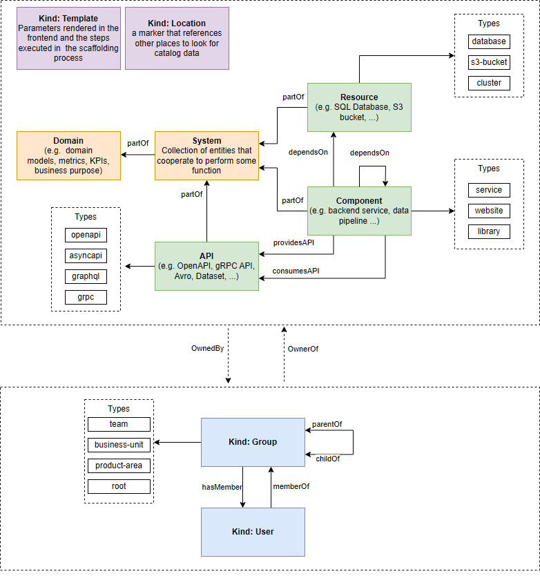
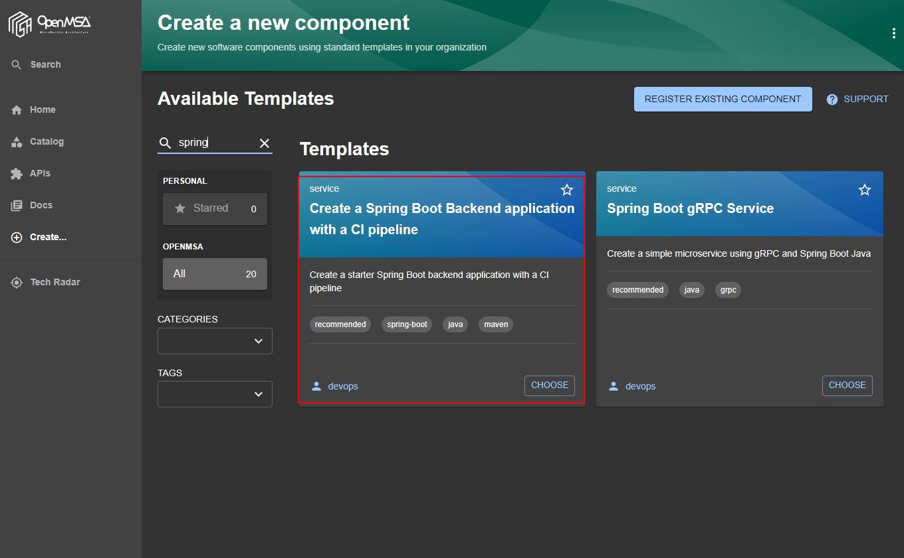
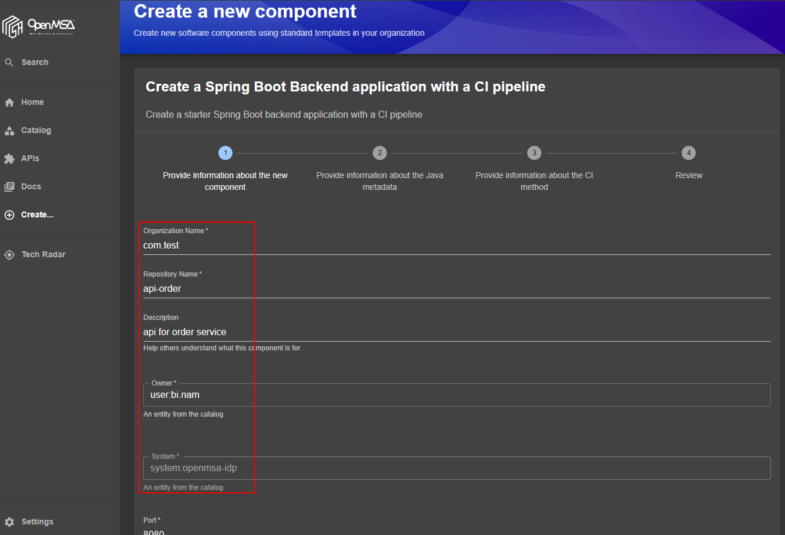
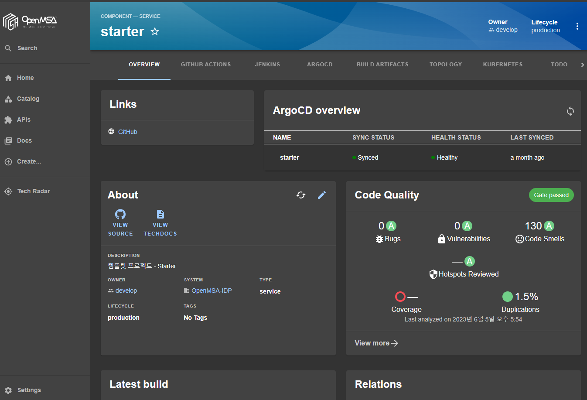

# [Backstage](https://backstage.io)

## 소개

OSS인 Backstage를 이용하여 내부 개발자 플랫폼을 구축하기 위한 프로젝트입니다.

[BackStage란?](./docs/index.md)

Backstage는 IDP([내부 개발자 플랫폼,Internal Develper Platform](https://www.redhat.com/ko/topics/devops/what-is-an-internal-developer-platform))이며, 다양한 기능을 통해 개발자들에게 생산성 향상을 위한 도구를 제공하고 좀 더 개발에 집중할 수 있도록 도와줍니다.

## 시작하기

### 환경 구성하기

Backstage는 node(react)로 개발되어 있으며 다음과 같은 도구들이 먼저 설치되어 있어야 합니다. 

- node, npm, yarn, node-gyp (node 18.x에서는 동작 확인 16.x에서는 불가)
- [로컬 환경 구성하기](./docs/local-dev/local-develop.md)

### Local 실행하기
```sh
# yarn 으로 dependency 설치
yarn install
# frontend , backend 실행
./start.sh
```

#### 실행파일 설명
- start.ps1/start.sh
    - Local PC에서 개발할때 app-config.yaml 파일의 ${} 처리된 변수를 치환해주는 역할
    - github api token 과 GitHub OAuth Apps secret 이 포함돼있으므로 커밋하지 마시고, .gitignore 에 등록후 로컬용도로 사용하세요.
    - (!) 현재 올라가있는 토큰은 revoke 돼있습니다.
    - mac 이나 linux 기반 환경은 start.sh 를 이용합니다.
- build-local.ps1/build-local.sh
    - Docker Image 생성후, nexus-oscka.openmsa.monster 에 docker image 를 push 하는 용도로 사용했습니다.

<!-- ### backstage 설치된 서버 -->
<!-- ```
# osckorea wifi 접속후
ssh oscka@192.168.41.50 -p 22

# vagrant 파일 위치
cd server-workspace/jinseul

# vagrant 접속
vagrant ssh
``` -->

## 사용하기

### 기능설명

Backstage는 기본적으로 카탈로그를 통해 개발자들에게 개발과 관련된 리소스에 접근할 수 있도록 하며, 템플릿을 통해 손쉽게 개발에 온보딩 할 수 있도록 준비된 구성을 만들어 줍니다.

- [카탈로그란?](./docs/software-catalog.md)
- [템플릿이란?](./docs/software-templates.md)

### 카탈로그 사용하기

Backstage 상의 모든 구성요소는 카탈로그 안에서 다음과 같은 이름으로 관리됩니다.



catalog-info.yaml은 다음과 같은 형태로 구성되며 backstage를 통해 CREATE > Register Existing Component 메뉴에서 import 할 경우 DB에 관련 데이터들을 import하여 해당 서비스에서 사용할 수 있게 됩니다.

```yaml
apiVersion: backstage.io/v1alpha1
kind: Component
metadata:
  name: OpenMSA-IDP
  title: OpenMSA-IDP
  description: |
    OpenMSA-IDP
  links:
    - title: GitHub
      url: https://github.com/oscka/backstage-custom
  annotations:
    backstage.io/techdocs-ref: dir:.
    backstage-custom.backstage.io/techdocs-builder: local
    backstage.io/managed-by-location: url:https://github.com/oscka/backstage-custom/blob/main/catalog-info.yaml
    github.com/project-slug: oscka/backstage-custom
    backstage.io/kubernetes-id: backstage
    nexus-repository-manager/docker.image-name: backstage
    argocd/app-name: backstage
spec:
  type: service
  system: openmsa-idp
  owner: team-develop
  lifecycle: production
  dependsOn:
    - resource:argocd
    - resource:nexus
    - resource:keycloak
    - resource:github
    - resource:sonarqube
    - resource:jenkins   
```

catalog 안에는 개발에 필요한 background 서비스, 솔루션, 어플리케이션들이 있으며 이를 사용하고 관리하기 위한 사용자, 권한, 그룹 들이 있습니다.

### 템플릿 사용하기

템플릿은 개발팀의 목적에 맞도록 준비되어야 하며 템플릿을 통해 생성된 프로젝트는 각 소프트웨어 개발단계에 맞게 "형상관리-빌드(CI)-이미지업로드(ImageRegistry)-배포(CD)-클러스터모니터링"과정을 한 set로 준비하고 있으며 이를 손쉽게 생성하여 개발자의 생산성 향상을 돕습니다.
개발자는 템플릿을 통해 한 과정의 서비스 컴포넌트를 생성할때 더 이상 jenkins, argocd 등의 도구의 주소를 기억하고 별도로 접근하여 pipeline을 만들 필요가 없습니다.
(아직 개발 전이며 이 가이드는 완성된 상태를 전제로 작성하였음)

템플릿을 통하여 다음과 같이 서비스 컴포넌트를 생성합니다.

생성을 원하는 템플릿을 선택합니다



템플릿 생성시 필요한 정보(패키지 정보, 프로젝트 정보 등)를 입력합니다.



생성된 컴포넌트 상에서 연결된 리소스 및 DevOps 도구들을 확인하여 실제 서비스 개발을 시작합니다.



개발팀은 DevOps 도구들 및 인프라 환경에 신경쓰지 않고 손쉽게 환경을 구성할 수 있으며 이를 한 화면에서 확인하고 관리할 수 있습니다.
